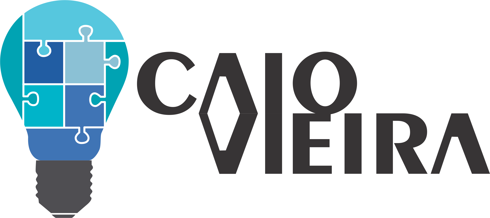

# CAIOVIEIRA STORE

## Repositório destinado ao projeto de loja virtual caio vieira

### Iniciando um novo projeto

```bash
git clone [repo]
yarn install # ou npm install

yarn start 
```


ARQUITETURA
===========

### Scripts do package.json

| Comando         | Descrição                                      | Quem usa                           |
|-----------------|------------------------------------------------|------------------------------------|
| start             | inicia o react-scripts-ts                      | inicia o projeto      |
| build           | gera os arquivos transpilados                  | gera os arquivos para produção |
| eject           | ejeta os arquivos do webpack (não recomendado) | desenvolvedor                      |
| test | roda os testes    | desenvolvedor                      |

### Sistema de pastas

* assets: pasta aonde contem as imagens.
* components: componentes do React.
* pages: telas separadas pelas áreas.
* util: funções genéricas que auxiliam na tarefa.
* hooks: hooks customizados
* services: responsável pela lógica de negócio e a comunicação com o servidor.
* __tests__: pasta onde ficam os testes 

---

## Tech
- [Typescript](https://www.typescriptlang.org/) - TypeScript é uma linguagem de código aberto que se baseia em JavaScript
- [ReactJS](https://pt-br.reactjs.org/) - Uma biblioteca JavaScript para criar interfaces de usuário